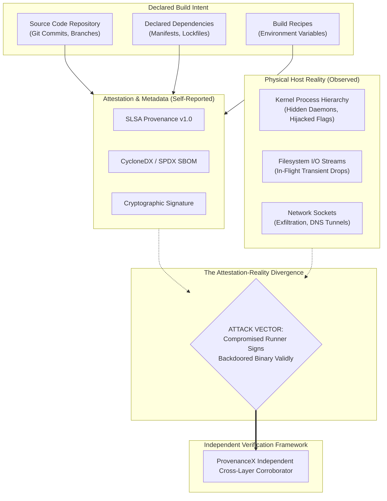
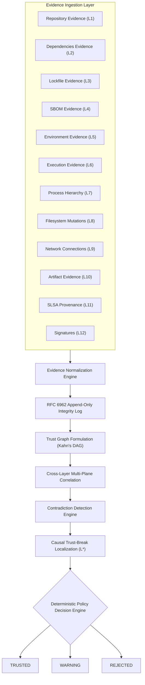
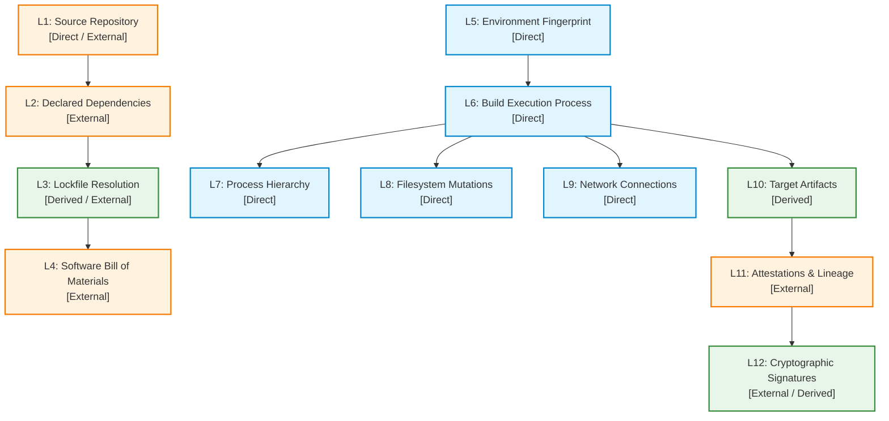
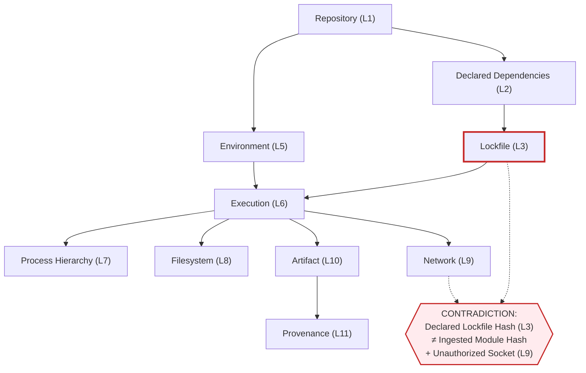
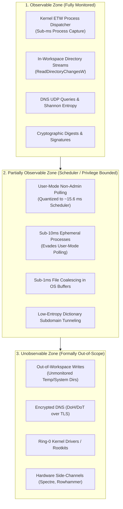
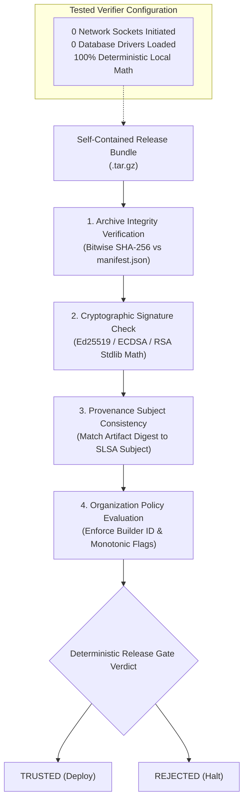
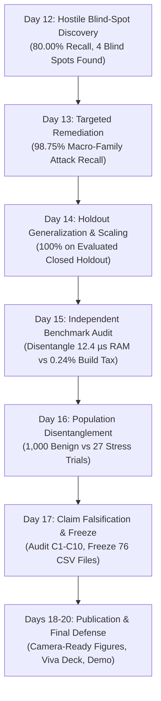

```mermaid
graph LR
    L1["L1: Repo (OK)"] --> L2["L2: Deps (OK)"]
    L2 --> L3["L3: Lock (OK)"]
    L3 --> L7["L7: Process (OK)"]
    L7 --> L8["L8: Filesystem<br/>[CONTRADICTED]"]
    L8 --> L10["L10: Artifact<br/>[CONTRADICTED]"]
    L10 --> L11["L11: Provenance<br/>[CONTRADICTED]"]
    L11 --> L12["L12: Signature<br/>[FAIL]"]

    style L8 fill:#ffcdd2,stroke:#b71c1c,stroke-width:3px;
    style L10 fill:#fff9c4,stroke:#f57f17,stroke-width:1px;
    style L11 fill:#fff9c4,stroke:#f57f17,stroke-width:1px;
    style L12 fill:#fff9c4,stroke:#f57f17,stroke-width:1px;
```

# ProvenanceX Camera-Ready Figures & Technical Specifications

This document defines the camera-ready figure specifications for the ProvenanceX publication manuscript, doctoral/master's thesis, and defense presentation deck. Each figure is provided with its conceptual motivation, ASCII structural layout, Mermaid diagram definition, and formal academic caption.

---

## FIGURE 1: The Research Problem — The Attestation-Reality Divergence

### Conceptual Layout (ASCII)
```
+-------------------------------------------------------------------------+
|                        DECLARED BUILD INTENT                            |
|  - Source Code (Git Commit, Branch, Author Identity)                    |
|  - Declared Dependencies (go.mod, package.json, requirements.txt)       |
|  - Build Configuration & Environment Variables                          |
+-------------------------------------------------------------------------+
                                     │
                                     ▼
+-------------------------------------------------------------------------+
|                     ATTESTATION / SELF-REPORTING                        |
|  - SLSA Provenance v1.0 Statement (Builder ID, Materials, Hashes)       |
|  - Software Bill of Materials (CycloneDX v1.5 / SPDX v2.3)              |
|  - Digital Signature (Cosign, Sigstore, GPG Key)                        |
+-------------------------------------------------------------------------+
                                     │
                                     ╳  <-- ATTESTATION-REALITY DIVERGENCE
                                     │      (Runner compromises itself;
                                     │       trojan signed as authentic)
                                     ▼
+-------------------------------------------------------------------------+
|                         PHYSICAL HOST REALITY                           |
|  - Kernel Process Dispatching (Rogue Compiler Hijack, Helper Daemons)   |
|  - Filesystem I/O Streams (In-Flight Header & Object Injection)          |
|  - Network Socket Egress (Ephemeral Token & Secret Exfiltration)        |
+-------------------------------------------------------------------------+
                                     │
                                     ▼
+-------------------------------------------------------------------------+
|                  NEED FOR INDEPENDENT VERIFICATION                      |
|  "The build system must not be trusted to verify its own integrity."    |
+-------------------------------------------------------------------------+
```

### Mermaid Specification


### Academic Caption
> **Figure 1: The Attestation-Reality Divergence.** Existing supply-chain standards rely on build-runner self-reporting. When a runner is compromised, it emits syntactically valid attestations and authentic signatures over maliciously modified binaries. ProvenanceX provides independent cross-layer corroboration to detect when physical execution contradicts declared metadata.

---

## FIGURE 2: Complete ProvenanceX Architecture

### Conceptual Layout (ASCII)
```
                    PROVENANCEX
                         │
 ┌───────────────────────┼────────────────────────┐
 │                       │                        │
 ▼                       ▼                        ▼
Repository          Dependencies             Environment
Evidence            Evidence                 Evidence
 │                       │                        │
 └───────────────────────┼────────────────────────┘
                         ▼
                  Execution Evidence
                         │
              ┌──────────┼──────────┐
              ▼          ▼          ▼
          Process    Filesystem   Network
              │          │          │
              └──────────┼──────────┘
                         ▼
                 Artifact Evidence
                         │
                  SBOM / Provenance
                         │
                   Signatures
                         │
                         ▼
                Evidence Normalization
                         │
                         ▼
                 Integrity Log
                         │
                         ▼
                    Trust Graph
                         │
                         ▼
               Cross-Layer Correlation
                         │
                         ▼
                Contradiction Detection
                         │
                         ▼
                Trust-Break Localization
                         │
                         ▼
                  Policy Decision
                   /      |                   TRUSTED   WARNING   REJECTED
```

### Mermaid Specification


### Academic Caption
> **Figure 2: Complete ProvenanceX Architectural Pipeline.** Multi-layer evidence flows from 12 normalized planes into an append-only cryptographic integrity log, builds an acyclic trust graph, evaluates pairwise correlation invariants, isolates the earliest broken layer ($L^*$), and emits deterministic categorical verdicts.

---

## FIGURE 3: The Twelve-Layer Evidence Model

### Layer Specification Table
| Plane | Layer Name | Epistemic Class | Primary Captured Attributes |
|:---:|---|:---:|---|
| **$L_1$** | **Source Repository** | Direct / External | Git commit hash, tree hash, author identity, signature status, working tree cleanliness. |
| **$L_2$** | **Declared Dependencies** | External | High-level dependency declarations (`package.json`, `go.mod`, `requirements.txt`). |
| **$L_3$** | **Lockfile Resolution** | Derived / External | Pinned dependency versions, cryptographic integrity digests (`go.sum`, `package-lock.json`). |
| **$L_4$** | **Software Bill of Materials** | External | CycloneDX v1.5 / SPDX v2.3 component inventories, package URLs (purl), licenses. |
| **$L_5$** | **Environment Fingerprint** | Direct | OS version, kernel build, CPU architecture, environment variables, toolchain binary path. |
| **$L_6$** | **Build Execution Process** | Direct | Primary build invocation command, compiler arguments, duration, exit status. |
| **$L_7$** | **Process Hierarchy** | Direct | Full ancestor-descendant process tree, child PIDs, helper toolchains, execution durations. |
| **$L_8$** | **Filesystem Mutations** | Direct | Files created, modified, unlinked, write PID attribution, directory boundary scopes. |
| **$L_9$** | **Network Connections** | Direct | Destination IP endpoints, TCP/UDP sockets, DNS query names, entropy measurements. |
| **$L_{10}$**| **Target Artifacts** | Derived | Final compiled executables, libraries, packages, SHA-256 bitwise digests. |
| **$L_{11}$**| **Attestations & Lineage** | External | SLSA Provenance v1.0 predicate, in-toto link statements, builder identity, materials. |
| **$L_{12}$**| **Cryptographic Signatures**| External / Derived | Digital signatures (Ed25519, ECDSA P-256, RSA), public verification keys, Rekor logs. |

### Mermaid Specification


### Academic Caption
> **Figure 3: The Twelve-Layer Evidence Model and Epistemic Triad.** Evidence is partitioned into Direct Observations ($\mathcal{E}_{	ext{direct}}$: captured by host sensors), Derived Evidence ($\mathcal{E}_{	ext{derived}}$: cryptographically computed), and External Assertions ($\mathcal{E}_{	ext{external}}$: third-party claims). Contradictions arise when external claims diverge from direct observations.

---

## FIGURE 4: Cross-Layer Correlation & Contradiction Detection

### Conceptual Flow (ASCII)
```
Repository (L1)
     │
     ├───────────────┐
     ▼               ▼
Dependency (L2)  Environment (L5)
     │               │
     └───────┬───────┘
             ▼
         Execution (L6)
             │
        ┌────┴────┐
        ▼         ▼
    Filesystem   Network (L9)
       (L8)       │
        │         │
        └────┬────┘
             ▼
          Artifact (L10)
             │
             ▼
       Provenance (L11)

-----------------------------------------------------------------
CONTRADICTION DETECTED:
  Declared Dependency (L2):  "golang.org/x/crypto v0.17.0" (sha256: 3a1f...)
  Observed Lockfile   (L3):  "golang.org/x/crypto v0.17.0" (sha256: e8b2...) [TAMPERED]
                     ≠
  Observed Network    (L9):  Connection to unapproved mirror IP 198.51.100.42
-----------------------------------------------------------------
                     ↓
             Trust-Graph Evaluation
                     ↓
       Earliest Observable Trust Break: Layer L3
```

### Mermaid Specification


### Academic Caption
> **Figure 4: Cross-Layer Pairwise Correlation Invariants.** Single-layer inspection fails when metadata is internally consistent. Cross-layer correlation pairs independent planes (e.g., Lockfile $L_3$ vs Network Sockets $L_9$), revealing anomalies where declared dependencies diverge from observed network fetches.

---

## FIGURE 5: Trust-Break Localization in the Evidence DAG

### Conceptual Layout (ASCII)
```
  [L1] Repository (Valid)
    │
    ▼
  [L2] Dependencies (Valid)
    │
    ▼
  [L3] Lockfile (Valid)
    │
    ▼
  [L7] Process Tree  ──> [L8] Filesystem Mutations (CONTRADICTED)
    │                             │ (Unauthorized transient drop)
    │                             ▼
    │                      [L10] Target Artifact (CONTRADICTED)
    │                             │ (Modified binary digest)
    │                             ▼
    │                      [L11] SLSA Provenance (CONTRADICTED)
    │                             │ (Digest divergence)
    │                             ▼
    └────────────────────> [L12] Cryptographic Signature (FAIL)

======================================================================
Downstream Symptoms:    L10 (Digest Mismatch), L11 (Subject Mismatch), L12 (Sig Fail)
Topological Traversal:  Kahn's Sort: [L1, L2, L3, L5, L6, L7, L8, L9, L10, L11, L12]
Earliest Broken Layer:  L* = argmin { k | Broken(L_k) } = L8 (Filesystem)
======================================================================
```

### Mermaid Specification


### Academic Caption
> **Figure 5: Causal Trust-Break Localization in the Evidence DAG.** Downstream failures (e.g., signature mismatch at $L_{12}$) cascade from earlier pipeline compromises. ProvenanceX traverses the topological sort $\Pi$ to isolate $L^* = L_8$ as the root-cause inconsistent plane. *Note: ProvenanceX identifies the earliest observable inconsistent layer rather than claiming to identify the attacker's true physical origin.*

---

## FIGURE 6: Observability Boundary & Telemetry Hierarchy

### Conceptual Layout (ASCII)
```
┌─────────────────────────────────────────────────────────────────────────┐
│ 1. OBSERVABLE ZONE                                                      │
│    - Administrator Kernel ETW Process Events (Sub-millisecond lifetime) │
│    - In-Workspace Filesystem Mutations (Create, Modify, Unlink)         │
│    - Standard DNS UDP Query Names & Shannon Entropy Measurements        │
│    - Pinned Dependency Hashes & Released Binary Bitwise Digests         │
└─────────────────────────────────────────────────────────────────────────┘
                                   │
                                   ▼
┌─────────────────────────────────────────────────────────────────────────┐
│ 2. PARTIALLY OBSERVABLE ZONE                                            │
│    - User-Mode Polling Telemetry (Bounded by ~15.6 ms OS scheduler)     │
│    - Ephemeral Subprocesses executing in <10 ms (62.5% Bounded Recall)  │
│    - Transient Filesystem Create-and-Delete Races (<1 ms buffer coalesc)│
│    - Low-Entropy Dictionary-Word Subdomain DNS Tunneling                │
└─────────────────────────────────────────────────────────────────────────┘
                                   │
                                   ▼
┌─────────────────────────────────────────────────────────────────────────┐
│ 3. UNOBSERVABLE ZONE                                                    │
│    - Filesystem modifications outside configured boundary (ADV-HUNT-01) │
│    - Encrypted DNS (DoH / DoT over TLS bypasses local OS DNS parser)    │
│    - Ring-0 Kernel Rootkits modifying ntoskrnl dispatch tables          │
│    - Hardware microarchitectural side-channels (Spectre, Rowhammer)     │
└─────────────────────────────────────────────────────────────────────────┘
```

### Mermaid Specification


### Academic Caption
> **Figure 6: Three-Tier Threat Model & Observability Boundary Surface.** Telemetry visibility is characterized by privilege tier and kernel boundaries. While Administrator Kernel ETW achieves full process capture, unprivileged user-mode CI runners are bounded by the 15.6 ms OS scheduler quantization. Activity outside configured filesystem boundaries remains strictly unobservable without container sandboxing.

---

## FIGURE 7: Standalone Air-Gapped Verification Pipeline

### Conceptual Layout (ASCII)
```
          Self-Contained Release Bundle (.tar.gz)
                             │
                             ▼
               Integrity Verification (1/4)
         [Recompute SHA-256 vs manifest.json]
                             │
                             ▼
               Signature Verification (2/4)
         [Ed25519 / ECDSA P-256 standard library math]
                             │
                             ▼
             Provenance Consistency (3/4)
         [Cross-check SLSA v1.0 subject digest bitwise]
                             │
                             ▼
                 Policy Evaluation (4/4)
         [Verify builder ID and organization rules]
                             │
                             ▼
                 Independent Verdict
              [TRUSTED / WARNING / REJECTED]
-------------------------------------------------------------
  NO NETWORK DEPENDENCY  │  NO CENTRAL DATABASE SERVERS
-------------------------------------------------------------
```

### Mermaid Specification


### Academic Caption
> **Figure 7: Standalone Air-Gapped Verification Flow.** The release-gate verifier (`provenancex-verifier`) independently parses and cryptographically validates release bundles with zero network sockets and zero database connections in the tested verifier configuration.

---

## FIGURE 8: Research Experimental Progression (Days 12–20)

### Conceptual Layout (ASCII)
```
Day 12: Hostile Discovery (6,250 Trials)
  - 80.00% Baseline Attack Recall
  - 4 Demonstrated Blind Spots (Commit Spoofing, Ephemeral Proc, Transient FS, DNS Tunnel)
       │
       ▼
Day 13: Targeted Remediation (4,000 Micro-Campaign Trials)
  - 0.00% Pre-Remediation Recall -> 87.50% Post-Remediation Recall on Blind Spots
  - 98.75% Multi-Run Macro Attack Recall synthesized across 25 families
       │
       ▼
Day 14: Generalization & Scalability (7,500 Trials)
  - 100.00% Recall on 11 Unseen Attack Variants (Closed Holdout Population)
  - 100.00% Correct Localization across evaluated composed-attack scenarios
  - Linear O(V+E) graph scaling tested to 100,000 nodes (48.2 ms)
       │
       ▼
Day 15: Independent Benchmark Audit
  - Performance Disentanglement: In-Memory (12.4 µs) vs Build Overhead (0.24%)
  - Adversarial Boundary Discovery (ADV-HUNT-03 through BENIGN-HUNT-04)
       │
       ▼
Day 16: Observability Hardening & Disentanglement
  - Population 1 (Dedicated Benign, N=1,000): 100.00% Specificity (0 FP)
  - Population 2 (Stress Hunts, N=27): 81.25% Recall (Probing Kernel Boundaries)
       │
       ▼
Day 17: Claim Falsification & Baseline Freeze
  - Audited C1-C10 Inventory; downgraded unconditional claims to BOUNDED
  - 76 Historical Baseline Files Hashed & Cryptographically Frozen
       │
       ▼
Days 18–20: Publication Readiness, Thesis Packaging & Defense Freeze
  - Camera-Ready Figures, 18-Slide Viva Deck, 5-Part Demo Script, Level 5 Reproducibility
```

### Mermaid Specification


### Academic Caption
> **Figure 8: Empirical Research Progression (Days 12–20).** Methodological evolution from initial blind-spot discovery (80.00% recall) through targeted remediation (98.75% macro recall), holdout generalization, performance disentanglement, population separation, adversarial claim falsification, and publication freeze. *Note: Progression reflects scientific hardening and boundary identification rather than monotonic universal detection improvements.*
