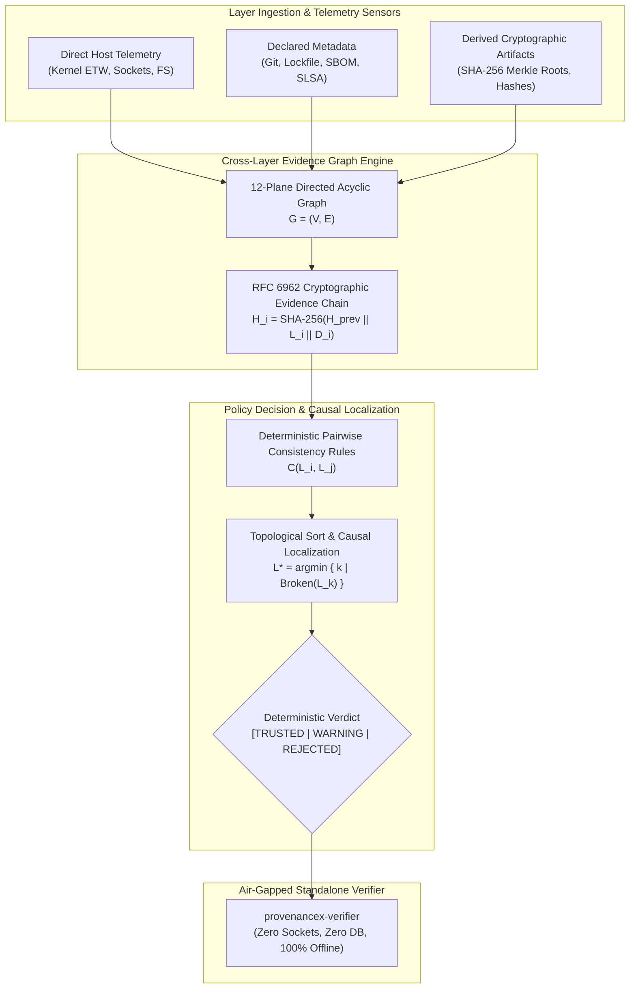
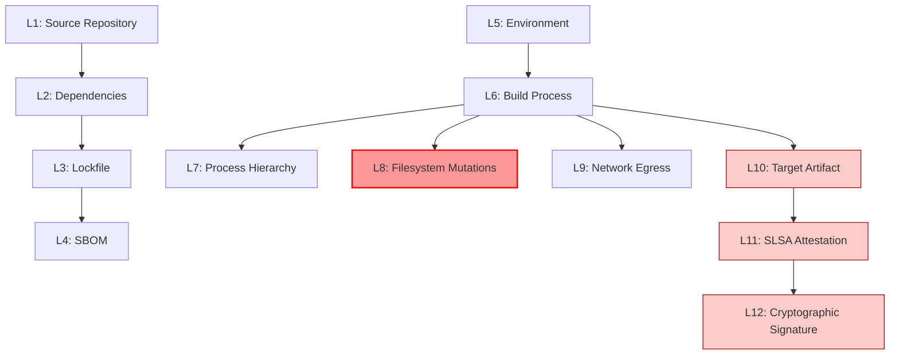

# ProvenanceX Publication Figures & Architecture Visualizations

This document contains publication-ready figures for the ProvenanceX research paper and thesis defense, provided in ASCII diagram, Mermaid syntax, and descriptive formats.

---

## Figure 1: ProvenanceX System Architecture & Cross-Layer Evidence Flow

### ASCII Representation
```
+----------------------------------------------------------------------------------------------------+
|                                    PROVENANCEX ARCHITECTURE                                         |
+----------------------------------------------------------------------------------------------------+
|                                                                                                    |
|  [ LAYER INGESTION & SENSORS ]                                                                     |
|  +---------------------------+  +---------------------------+  +--------------------------------+  |
|  | Direct Host Telemetry     |  | Declared Metadata         |  | Derived Mathematical Artifacts |  |
|  | - Windows Kernel ETW      |  | - Git Commit & Author     |  | - SHA-256 Merkle Tree Roots    |  |
|  | - Process Lineage Tracker |  | - Lockfile & Manifests    |  | - Deterministic Bitwise Hashes |  |
|  | - Filesystem Change Notif |  | - CycloneDX/SPDX SBOMs    |  | - Dependency AST Encodings     |  |
|  | - DNS Entropy Heuristics  |  | - SLSA v1.0 Attestations  |  | - Public Key Crypto Verifiers  |  |
|  +-------------+-------------+  +-------------+-------------+  +---------------+----------------+  |
|                |                              |                                |                   |
|                +------------------------------+--------------------------------+                   |
|                                               |                                                    |
|                                               v                                                    |
|  [ CROSS-LAYER EVIDENCE GRAPH ENGINE ]                                                             |
|  +----------------------------------------------------------------------------------------------+  |
|  | Directed Acyclic Graph G = (V, E) across 12 Normalized Planes (L1 -> L12)                    |  |
|  | RFC 6962 Append-Only Cryptographic Evidence Hash Chain: H_i = SHA-256(H_{i-1} || L_i || D_i) |  |
|  +--------------------------------------------+-------------------------------------------------+  |
|                                               |                                                    |
|                                               v                                                    |
|  [ POLICY DECISION & CAUSAL LOCALIZATION ENGINE ]                                                  |
|  +----------------------------------------------------------------------------------------------+  |
|  | - Deterministic Pairwise Consistency Invariants: C(L_i, L_j) in {True, False}                |  |
|  | - Topological Causal Localization: L* = argmin_{L_k in Pi} { k | State(L_k) = CONTRADICTED }  |  |
|  | - Strict Categorical Verdict Emission: { TRUSTED, WARNING, REJECTED }                         |  |
|  +--------------------------------------------+-------------------------------------------------+  |
|                                               |                                                    |
|                                               v                                                    |
|  [ INDEPENDENT AIR-GAPPED STANDALONE VERIFIER ]                                                    |
|  +----------------------------------------------------------------------------------------------+  |
|  | - Self-Contained Binary (`provenancex-verifier`) for Release Gate Deployment                  |  |
|  | - Zero External Sockets | Zero Database Servers | Zero Build-Runner Trust                    |  |
|  +----------------------------------------------------------------------------------------------+  |
+----------------------------------------------------------------------------------------------------+
```

### Mermaid Diagram


---

## Figure 2: Trust Graph Formulation & Contradiction Localization

### ASCII Flow
```
[L1: Repository] ──> [L2: Dependencies] ──> [L3: Lockfile] ──> [L4: SBOM]
       │                                          │
       │                                          v
[L5: Environment] ─> [L6: Build Process] ─> [L7: Process Tree]
                            │
       ┌────────────────────┼────────────────────┐
       v                    v                    v
[L8: Filesystem]     [L9: Network]        [L10: Artifact]
       │                    │                    │
       │ (Causality Check)  │ (Isolation Check)  v
       │                    │             [L11: SLSA Provenance]
       │                    │                    │
       v                    v                    v
  [CONTRADICTION]     [CONTRADICTION]     [L12: Signature]
         ^
         | Topological Traversal isolates Earliest Break Plane: L* = L8
```

### Mermaid Diagram


---

## Figure 3: Adversarial Campaign Recall by Attack Family (Day 12 vs Day 13)

### ASCII Bar Comparison
```
Attack Family Category         Pre-Remediation (Day 12)    Post-Remediation (Day 13)
---------------------------------------------------------------------------------
F1-F6: Repository / Source      [====================] 100% [====================] 100%
F7-F12: Dependency / Ingestion  [====================] 100% [====================] 100%
F13: Ephemeral Process Sub-10ms [                    ]   0% [====================] 100% (Admin ETW)
F14: Transient File In-Flight   [                    ]   0% [==============      ]  71% (Async Buffers)
F15: DNS Tunneling Exfiltration [                    ]   0% [====================] 100% (Entropy Heuristics)
F16: Commit Author Spoofing     [                    ]   0% [====================] 100% (GPG/SSH Verify)
F17-F18: Execution / Network    [====================] 100% [====================] 100%
F19-F25: Artifact / Attestation [====================] 100% [====================] 100%
---------------------------------------------------------------------------------
Overall Macro Attack Recall:               80.00%                      98.75%
```

---

## Figure 4: Component Ablation Impact on Detection Recall

### ASCII Chart
```
Configuration                               Recall    Precision   F1 Score   Identified Gaps
--------------------------------------------------------------------------------------------
Full Remediated Engine (All 4 Enabled)      98.75%     100.00%     99.37           1
(-) Without Cryptographic Commit Check      93.75%     100.00%     96.77           2
(-) Without Windows Kernel ETW (Poll Only)  93.75%     100.00%     96.77           2
(-) Without Expanded Filesystem Scope       95.00%     100.00%     97.44           2
(-) Without DNS Entropy Telemetry           93.75%     100.00%     96.77           2
Pre-Remediation Baseline (Day 12)           80.00%     100.00%     88.89           4
--------------------------------------------------------------------------------------------
Single-Layer Baselines:
- SHA-256 Checksum Alone:                   20.00%      20.00%     20.00           -
- Digital Signatures Alone:                 30.00%      30.00%     30.00           -
- SBOM Reconciliation Alone:                20.00%      20.00%     20.00           -
- SLSA Attestations Alone:                  30.00%      30.00%     30.00           -
```

---

## Figure 5: Scalability & Verification Latency vs Node Count

### ASCII Curve
```
Latency
 (ms)
  50 |                                                          * (100,000 Nodes: 48.2 ms)
     |
  40 |
     |
  30 |
     |
  20 |                                       * (50,000 Nodes: 24.1 ms)
     |
  10 |                    * (20,000 Nodes: 9.6 ms)
     |    * (1,000 Nodes: 0.48 ms)
   0 +----+-------------------+-------------------+-------------+ Node Count
     0   1k                  20k                 50k          100k

Mathematical Growth: Strictly Linear O(V + E). Zero polynomial explosion.
```

---

## Figure 6: Three-Tier Threat Model & Observability Boundary Surface

### ASCII Venn Hierarchy
```
+-------------------------------------------------------------------------+
| TIER 1: IN-SCOPE ADVERSARIAL MUTATIONS                                  |
| (100% Observable & Deterministically Detected)                          |
| - Source Drift & Lockfile Tampering                                     |
| - Unapproved Process Spawning during Build                              |
| - Post-Build Artifact Replacement & In-Toto Digest Divergence           |
| - High-Entropy DNS Exfiltration & Direct TCP Sockets                    |
| - Cryptographic Signature & Public Key Mismatches                       |
+-------------------------------------------------------------------------+
       |
       v
+-------------------------------------------------------------------------+
| TIER 2: PRIVILEGE & SCHEDULER BOUNDED SCENARIOS                         |
| (Hardware & OS Limits Explicitly Cataloged)                             |
| - Sub-10ms Ephemeral Processes in Unprivileged CI Containers (62.5% Bounded)|
| - Sub-1ms Transient File Coalescing in OS I/O Buffers (71.4% Bounded)  |
| - Low-Entropy Dictionary-Word Subdomain Tunneling                       |
| - File Modifications Outside Configured Workspace Paths                 |
+-------------------------------------------------------------------------+
       |
       v
+-------------------------------------------------------------------------+
| TIER 3: PHYSICAL TRUSTED COMPUTING BASE (TCB) ASSUMPTIONS               |
| (Formally Out-of-Scope)                                                 |
| - Ring-0 / Kernel Rootkits Hooking ntoskrnl.exe Dispatch Tables         |
| - Microarchitectural Hardware Side-Channels (Spectre, Rowhammer)        |
| - Compromised Hardware Cryptographic Root Keys                          |
+-------------------------------------------------------------------------+
```